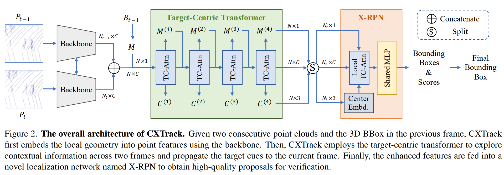

# CXTrack:Improving 3D Point Cloud Tracking with Contextual Information (CVPR2023)

The official code release of [CXTrack](https://arxiv.org/pdf/2211.08542.pdf).

An open source platform for general 3D single object tracking, based on [Open3DSOT](https://github.com/Ghostish/Open3DSOT).

## CXTrack

3D single object tracking plays an essential role in many applications, such as autonomous driving. It remains a challenging problem due to the large appearance variation and the sparsity of points caused by occlusion and limited sensor capabilities. Therefore, contextual information across two consecutive frames is crucial for effective object tracking. \YC{However, points containing such useful information are often overlooked and cropped out in existing methods, leading to insufficient use of important contextual knowledge. To address this issue, we propose CXTrack, a novel transformer-based network for 3D object tracking, which exploits ConteXtual information to improve the tracking results. Specifically, we design a target-centric transformer network that directly takes point features from two consecutive frames and the previous bounding box as input to explore contextual information and implicitly propagate target cues. To achieve accurate localization for objects of all sizes, we propose a transformer-based localization head with a novel center embedding module to distinguish the target from distractors. Extensive experiments on three large-scale datasets, KITTI, nuScenes and Waymo Open Dataset, show that CXTrack achieves state-of-the-art tracking performance while running at 34 FPS on a single NVIDIA RTX3090 GPU. 

<p align="center">

</p>

## Setup

Here we list the most important part of our dependencies

|Dependency|Version|
|---|---|
|open3d|0.15.2|
|python|3.8.0|
|pytorch|1.8.0(cuda11.1,cudnn8.0.5)|
|pytorch-lightning|1.5.10|
|pytorch3d|0.6.2|
|shapely|1.8.1|
|torchvision|0.9.0| 

Others can be seen in [Open3DSOT](https://github.com/Ghostish/Open3DSOT)

### KITTI

+ Download the data for [velodyne](http://www.cvlibs.net/download.php?file=data_tracking_velodyne.zip), [calib](http://www.cvlibs.net/download.php?file=data_tracking_calib.zip) and [label_02](http://www.cvlibs.net/download.php?file=data_tracking_label_2.zip) from [KITTI Tracking](http://www.cvlibs.net/datasets/kitti/eval_tracking.php).
+ Unzip the downloaded files.
+ Put the unzipped files under the same folder as following.
  ```
  [Parent Folder]
  --> [calib]
      --> {0000-0020}.txt
  --> [label_02]
      --> {0000-0020}.txt
  --> [velodyne]
      --> [0000-0020] folders with velodynes .bin files
  ```
### Waymo Open Dataset

* We follow the benchmark created by [LiDAR-SOT](https://github.com/TuSimple/LiDAR_SOT) based on the waymo open dataset. You can download and process the waymo dataset as guided by [LiDAR_SOT](https://github.com/TuSimple/LiDAR_SOT), and use our code to test model performance on this benchmark.
* The following processing results are necessary
```
[waymo_sot]
    [benchmark]
        [validation]
            [vehicle]
                bench_list.json
                easy.json
                medium.json
                hard.json
            [pedestrian]
                bench_list.json
                easy.json
                medium.json
                hard.json
    [pc]
        [raw_pc]
            Here are some segment.npz files containing raw point cloud data
    [gt_info]
        Here are some segment.npz files containing tracklet and bbox data
```

### NuScenes

We follow [V2B](https://github.com/fpthink/V2B) to prepare the nuscenes dataset, and we also cite the following sentences from [STNet](https://github.com/fpthink/STNet)


> Since both kitti and waymo are datasets constructed from 64-line LiDAR, nuScenes is a 32-line LiDAR. We recommend you: train your model on KITTI and verify the generalization ability of your model on waymo. Train on nuScenes or simply skip this dataset. We do not recommend that you verify the generalization ability of your model on nuScenes. 

**Tips: If you have the wrong version of NuScenes dependencies, you will most likely not reproduce our results.**

## Get Started

### Training

To train a model, you must specify the `.yaml` file. The `.yaml` file contains all the configurations of the dataset and the model. We provide `.yaml` files under the [*configs*](./configs) directory. **Note:** Before running the code, you will need to edit the `.yaml` file by setting the `path` argument as the correct root of the dataset.
```bash
python main.py configs/cxtrack_kitti_pedestrian_cfg.yaml --gpus 0 1
```

### Testing

To test a trained model, specify the checkpoint location with `--resume_from` argument and set the `--phase` argument as `test`.
```bash
python main.py configs/cxtrack_kitti_pedestrian_cfg.yaml --phase test --resume_from pretrained/cxtrack_kitti_pedestrian_91.5_67.0.ckpt
```

## Acknowledgement

+ This repo is heavily built upon [Open3DSOT](https://github.com/Ghostish/Open3DSOT) and [STNet](https://github.com/fpthink/STNet).
+ Thank Erik Wijmans for his pytorch implementation of [PointNet++](https://github.com/erikwijmans/Pointnet2_PyTorch)

## License
This repository is released under MIT License (see LICENSE file for details).